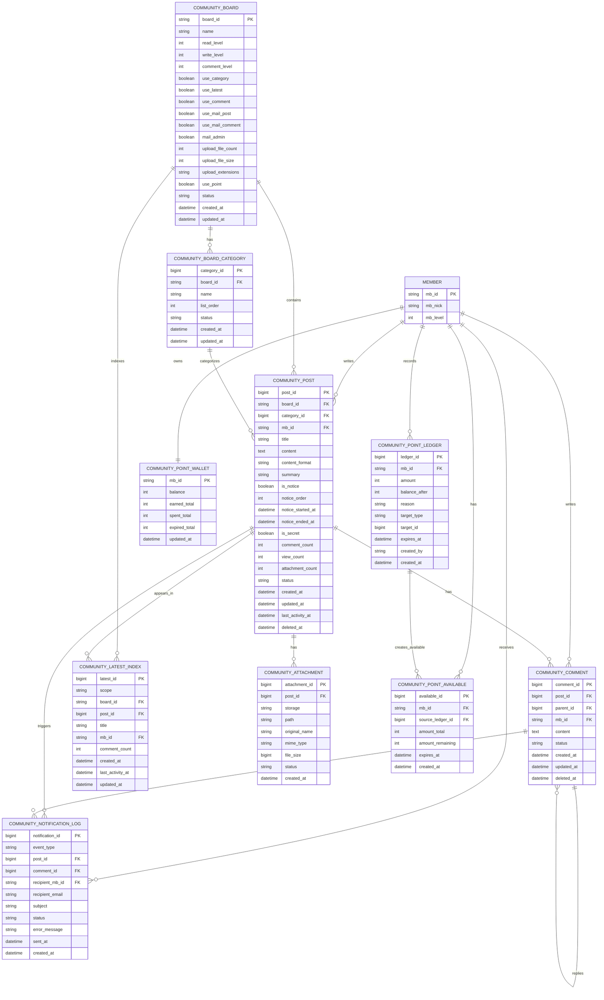

# 커뮤니티 기능 복구 상세 계획

## 1. 목적

현재 저장소는 회원, 인증, 관리자 기능 중심으로 재구성된 G5 런타임이다. 커뮤니티 기능은 기존 그누보드5 게시판을 그대로 되살리는 방식이 아니라, 기존 코드를 참조하되 현재 프로젝트의 도메인 구조와 운영 요구에 맞춰 새로 복구한다.

복구 대상의 핵심은 다음 네 가지다.

- 기본 게시판 기능
- 여러 화면에서 재사용 가능한 최신글 기능
- 게시물 작성자와 댓글 작성자에게 발송하는 메일 알림
- 회원 포인트와 분리된 커뮤니티 전용 포인트

고부하 운영 경험에서 확인된 병목을 설계 단계부터 피한다. 특히 게시판별 동적 테이블, 최신글 UNION, 목록 N+1 쿼리, 포인트 합산 계산, 테이블 단위 락, DB 기반 방문자/현재접속자 기록은 기본 구조로 채택하지 않는다.

## 2. 설계 원칙

### 2.1 기존 그누보드5는 참조만 한다

기존 그누보드5의 UI 흐름, 권한 개념, 게시판 설정 항목, 관리자 운영 방식은 참고한다. 그러나 다음 구조는 그대로 복구하지 않는다.

- `g5_write_{bo_table}` 방식의 게시판별 동적 테이블
- 여러 게시판 최신글을 UNION으로 조회하는 구조
- 게시글과 댓글을 한 테이블에 섞는 구조
- 포인트 잔액을 매번 전체 합산으로 계산하는 구조
- `get_unique()`처럼 테이블 단위 락을 잡는 키 생성 방식

### 2.2 현재 프로젝트의 도메인 경계를 따른다

새 커뮤니티 코드는 회원/관리자 도메인과 같은 스타일로 배치한다.

```text
community/
lib/domain/community/
community/views/basic/
adm/
```

컨트롤러 파일은 요청 흐름만 담당하고, 요청 정규화, 검증, 저장, 화면 데이터 구성은 `lib/domain/community/` 아래 함수로 분리한다.

### 2.3 읽기 부하를 쓰기 시점에 흡수한다

최신글, 댓글 수, 마지막 활동일, 포인트 잔액처럼 자주 읽히는 값은 읽을 때 매번 계산하지 않는다. 쓰기 트랜잭션 안에서 집계 컬럼이나 인덱스 테이블을 갱신한다.

### 2.4 모든 저장 작업은 트랜잭션 기준으로 설계한다

게시글 작성, 수정, 삭제, 댓글 작성, 포인트 지급은 모두 트랜잭션 단위로 처리한다. 포인트처럼 데드락 가능성이 높은 작업은 테이블 접근 순서를 고정한다.

권장 순서:

1. 대상 게시글 또는 댓글 row 잠금
2. 포인트 wallet row 잠금 또는 생성
3. 포인트 ledger 기록
4. 포인트 available 기록 또는 갱신
5. wallet 잔액 갱신
6. 게시글 집계 및 최신글 인덱스 갱신

### 2.5 목록 화면의 N+1 쿼리를 금지한다

게시글 목록에서 작성자, 댓글 수, 첨부 여부를 글마다 개별 조회하지 않는다. 목록 조회는 JOIN 또는 bulk fetch를 사용한다.

## 3. 디렉터리 계획

### 3.1 사용자 커뮤니티

```text
community/
  _common.php
  index.php
  board.php
  view.php
  write.php
  write_update.php
  delete.php
  comment_update.php
  latest.php
  views/
    basic/
      board.list.php
      board.view.php
      board.form.php
      comment.list.php
      latest.list.php
```

### 3.2 도메인 라이브러리

```text
lib/domain/community/
  community.lib.php
  runtime.lib.php
  request.lib.php
  validation.lib.php
  board-request.lib.php
  board-validation.lib.php
  board-persist.lib.php
  board-render.lib.php
  comment-request.lib.php
  comment-validation.lib.php
  comment-persist.lib.php
  latest.lib.php
  notification.lib.php
  point.lib.php
  search.lib.php
  cache.lib.php
  admin-request.lib.php
  admin-validation.lib.php
  admin-persist.lib.php
  admin-render.lib.php
```

`community.lib.php`는 aggregate loader 역할만 맡는다. 세부 기능은 파일별로 나눈다.

### 3.3 관리자

```text
adm/
  admin.menu300.php
  community_board_list.php
  community_board_form.php
  community_board_form_update.php
  community_post_list.php
  community_comment_list.php
  community_notification_log.php
  community_point_list.php
  community_point_adjust.php
```

메뉴 코드는 `300000`대를 사용한다.

## 4. 상수 및 런타임 연결

`config.php`에 커뮤니티 경로 상수를 추가한다.

```php
define('G5_COMMUNITY_DIR', 'community');
define('G5_COMMUNITY_URL', G5_URL . '/' . G5_COMMUNITY_DIR);
define('G5_COMMUNITY_PATH', G5_PATH . '/' . G5_COMMUNITY_DIR);
define('G5_COMMUNITY_VIEW_PATH', G5_COMMUNITY_PATH . '/views');
```

테이블명은 `g5` 런타임 배열에 등록한다. 기존 `G5_TABLE_PREFIX`를 따른다.

```php
$g5['community_board_table'] = G5_TABLE_PREFIX . 'community_board';
$g5['community_board_category_table'] = G5_TABLE_PREFIX . 'community_board_category';
$g5['community_post_table'] = G5_TABLE_PREFIX . 'community_post';
$g5['community_comment_table'] = G5_TABLE_PREFIX . 'community_comment';
$g5['community_latest_table'] = G5_TABLE_PREFIX . 'community_latest_index';
$g5['community_notification_table'] = G5_TABLE_PREFIX . 'community_notification_log';
$g5['community_point_ledger_table'] = G5_TABLE_PREFIX . 'community_point_ledger';
$g5['community_point_available_table'] = G5_TABLE_PREFIX . 'community_point_available';
$g5['community_point_wallet_table'] = G5_TABLE_PREFIX . 'community_point_wallet';
$g5['community_attachment_table'] = G5_TABLE_PREFIX . 'community_attachment';
```

등록 위치는 기존 테이블 배열이 초기화되는 파일을 확인한 뒤, 같은 레이어에 추가한다. 직접 전역을 흩뿌리지 않는다.

## 5. DB 스키마 계획

### 5.1 ERD



관계 해석 기준:

- `MEMBER`는 기존 회원 테이블을 의미하며, 새 커뮤니티 포인트는 기존 `mb_point`와 분리한다.
- `COMMUNITY_BOARD_CATEGORY`는 게시판별 카테고리를 별도 테이블로 관리한다.
- `COMMUNITY_POST.updated_at`은 제목/본문 수정 시점이고, `last_activity_at`은 댓글 등 커뮤니티 활동 시점이다.
- `COMMUNITY_LATEST_INDEX`는 최신글 조회용 인덱스 테이블이며, 원본 게시글 데이터는 `COMMUNITY_POST`에 둔다.
- `COMMUNITY_NOTIFICATION_LOG`는 메일 알림 발송 이력과 실패 상태를 추적한다.
- `COMMUNITY_POINT_LEDGER`는 모든 포인트 변동 원장이고, `COMMUNITY_POINT_WALLET`은 잔액 캐시, `COMMUNITY_POINT_AVAILABLE`은 만료/차감 가능한 포인트 단위다.

### 5.2 게시판 설정

`community_board`

| 컬럼 | 설명 |
| --- | --- |
| `board_id` | 게시판 ID, 영문/숫자/underscore |
| `name` | 게시판 이름 |
| `description` | 관리자 설명 |
| `read_level` | 읽기 권한 레벨 |
| `write_level` | 쓰기 권한 레벨 |
| `comment_level` | 댓글 권한 레벨 |
| `list_order` | 관리자 정렬 |
| `use_category` | 분류/카테고리 사용 여부 |
| `use_latest` | 최신글 노출 여부 |
| `use_comment` | 댓글 사용 여부 |
| `use_mail_post` | 게시물 작성자에게 댓글 알림 발송 여부 |
| `use_mail_comment` | 댓글 작성자에게 후속 댓글 알림 발송 여부 |
| `mail_admin` | 관리자에게 게시물/댓글 알림 발송 여부 |
| `upload_file_count` | 게시글당 첨부파일 최대 개수 |
| `upload_file_size` | 첨부파일 1개당 최대 용량 |
| `upload_extensions` | 허용 첨부 확장자 목록 |
| `use_point` | 커뮤니티 포인트 사용 여부 |
| `point_write` | 글 작성 지급 포인트 |
| `point_comment` | 댓글 작성 지급 포인트 |
| `point_read` | 열람 차감 또는 지급 포인트 |
| `status` | active, hidden, archived |
| `created_at` | 생성일 |
| `updated_at` | 수정일 |

주요 인덱스:

- `PRIMARY KEY (board_id)`
- `KEY idx_status_order (status, list_order)`
- `KEY idx_latest (use_latest, status)`

### 5.3 게시판 카테고리

`community_board_category`

| 컬럼 | 설명 |
| --- | --- |
| `category_id` | 카테고리 PK |
| `board_id` | 게시판 ID |
| `name` | 카테고리 이름 |
| `list_order` | 정렬 순서 |
| `status` | active, hidden, deleted |
| `created_at` | 생성일 |
| `updated_at` | 수정일 |

주요 인덱스:

- `PRIMARY KEY (category_id)`
- `KEY idx_board_order (board_id, status, list_order)`
- `UNIQUE KEY uq_board_category_name (board_id, name)`

카테고리는 문자열 설정값이 아니라 별도 테이블로 둔다. 게시글에는 `category_id`를 저장하고, 목록 표시 편의를 위해 필요 시 이름을 JOIN한다.

부하 대응:

- 카테고리 목록은 게시판별로 작고 변경 빈도가 낮으므로 `community:board:{board_id}:categories` 형태로 캐시한다.
- 게시글 목록 필터는 `community_post.category_id`와 `idx_board_category` 인덱스를 사용한다.
- 목록에서 카테고리명을 표시할 때는 `LEFT JOIN community_board_category` 1회 또는 캐시된 category map을 사용한다.
- 글마다 카테고리명을 개별 조회하는 N+1 패턴은 금지한다.

### 5.4 게시글 현재 상태

`community_post`

| 컬럼 | 설명 |
| --- | --- |
| `post_id` | 게시글 PK |
| `board_id` | 게시판 ID |
| `category_id` | 게시판 카테고리 ID |
| `mb_id` | 작성자 |
| `title` | 제목 |
| `content` | 본문 |
| `content_format` | html, markdown, plain |
| `summary` | 최신글/목록용 요약 |
| `is_notice` | 공지글 여부 |
| `notice_order` | 공지글 정렬 순서 |
| `notice_started_at` | 공지 노출 시작일, 없으면 즉시 노출 |
| `notice_ended_at` | 공지 노출 종료일, 없으면 무기한 노출 |
| `is_secret` | 비밀글 여부 |
| `comment_count` | 댓글 수 캐시 |
| `view_count` | 조회 수 |
| `attachment_count` | 첨부 수 |
| `status` | published, hidden, deleted |
| `created_at` | 최초 작성일 |
| `updated_at` | 제목/본문 수정일 |
| `last_activity_at` | 댓글 등 활동 갱신일 |
| `deleted_at` | 삭제일 |

주요 인덱스:

- `PRIMARY KEY (post_id)`
- `KEY idx_board_list (board_id, status, last_activity_at, post_id)`
- `KEY idx_board_notice (board_id, status, is_notice, notice_order, notice_started_at, notice_ended_at, post_id)`
- `KEY idx_board_category (board_id, category_id, status, last_activity_at, post_id)`
- `KEY idx_board_created (board_id, status, created_at, post_id)`
- `KEY idx_author (mb_id, created_at)`
- `KEY idx_updated (updated_at, post_id)`

`updated_at`은 게시글 자체 수정에만 사용한다. 댓글 작성으로 바꾸지 않는다. 검색 델타 인덱싱은 `updated_at`을 기준으로 한다.

### 5.5 댓글

`community_comment`

| 컬럼 | 설명 |
| --- | --- |
| `comment_id` | 댓글 PK |
| `post_id` | 게시글 ID |
| `parent_id` | 대댓글 부모 |
| `mb_id` | 작성자 |
| `content` | 댓글 내용 |
| `status` | published, hidden, deleted |
| `created_at` | 작성일 |
| `updated_at` | 수정일 |
| `deleted_at` | 삭제일 |

주요 인덱스:

- `PRIMARY KEY (comment_id)`
- `KEY idx_post_list (post_id, status, comment_id)`
- `KEY idx_author (mb_id, created_at)`

댓글은 게시글 테이블과 분리한다. 댓글 작성 시 `community_post.comment_count`, `last_activity_at`만 갱신한다.

### 5.6 최신글 인덱스

`community_latest_index`

| 컬럼 | 설명 |
| --- | --- |
| `latest_id` | PK |
| `scope` | all 또는 board |
| `board_id` | 게시판 ID, 전체 최신글이면 빈 값 |
| `post_id` | 게시글 ID |
| `title` | 최신글 표시 제목 |
| `mb_id` | 작성자 |
| `comment_count` | 댓글 수 |
| `created_at` | 게시글 작성일 |
| `last_activity_at` | 정렬 기준 |
| `updated_at` | 인덱스 갱신일 |

주요 인덱스:

- `UNIQUE KEY uq_scope_post (scope, board_id, post_id)`
- `KEY idx_scope_latest (scope, board_id, last_activity_at, post_id)`

최신글은 조회 시 UNION하지 않는다. 게시글 생성, 수정, 삭제, 댓글 작성, 댓글 삭제 이벤트에서 인덱스를 갱신한다.

### 5.7 메일 알림 발송 이력

`community_notification_log`

| 컬럼 | 설명 |
| --- | --- |
| `notification_id` | 알림 PK |
| `event_type` | post_created, comment_created 등 |
| `post_id` | 관련 게시글 ID |
| `comment_id` | 관련 댓글 ID, 게시글 알림이면 0 또는 NULL |
| `recipient_mb_id` | 수신 회원 ID |
| `recipient_email` | 발송 시점의 수신 이메일 |
| `subject` | 메일 제목 |
| `status` | pending, sent, failed, skipped |
| `error_message` | 실패 사유 |
| `sent_at` | 발송 완료일 |
| `created_at` | 생성일 |

주요 인덱스:

- `PRIMARY KEY (notification_id)`
- `KEY idx_recipient_created (recipient_mb_id, created_at)`
- `KEY idx_target (post_id, comment_id)`
- `KEY idx_status_created (status, created_at)`

알림 대상:

- 게시물 작성자: 본인 외 사용자가 댓글을 작성하면 발송
- 댓글 작성자: 본인 외 사용자가 같은 게시물에 후속 댓글을 작성하면 발송
- 관리자: 게시판 설정 `mail_admin`이 켜진 경우 게시물/댓글 작성 시 발송

중복 발송을 피하기 위해 한 이벤트 안에서는 수신자를 회원 ID 기준으로 dedupe한다. 작성자 본인에게는 발송하지 않는다.

### 5.8 커뮤니티 포인트 원장

`community_point_ledger`

| 컬럼 | 설명 |
| --- | --- |
| `ledger_id` | 원장 PK |
| `mb_id` | 회원 ID |
| `amount` | 증감 포인트 |
| `balance_after` | 처리 후 잔액 |
| `reason` | write, comment, read, admin_adjust 등 |
| `target_type` | post, comment, admin 등 |
| `target_id` | 대상 ID |
| `expires_at` | 만료일, 없으면 NULL |
| `created_by` | 관리자 또는 시스템 |
| `created_at` | 생성일 |

주요 인덱스:

- `PRIMARY KEY (ledger_id)`
- `KEY idx_member_ledger (mb_id, ledger_id)`
- `KEY idx_target (target_type, target_id)`
- `KEY idx_expires (expires_at)`

중복 지급 방지가 필요한 사유는 별도 유니크 키를 검토한다.

예:

```text
UNIQUE KEY uq_once_reward (mb_id, reason, target_type, target_id)
```

단, 관리자 수동 조정처럼 반복 가능한 사유에는 적용하지 않는다.

### 5.9 사용 가능 포인트

`community_point_available`

| 컬럼 | 설명 |
| --- | --- |
| `available_id` | PK |
| `mb_id` | 회원 ID |
| `source_ledger_id` | 지급 원장 ID |
| `amount_total` | 최초 지급량 |
| `amount_remaining` | 남은 포인트 |
| `expires_at` | 만료일 |
| `created_at` | 생성일 |

주요 인덱스:

- `KEY idx_member_available (mb_id, expires_at, available_id)`
- `KEY idx_source_ledger (source_ledger_id)`

포인트 차감 시 만료가 빠른 단위부터 차감한다.

### 5.10 포인트 잔액

`community_point_wallet`

| 컬럼 | 설명 |
| --- | --- |
| `mb_id` | 회원 ID |
| `balance` | 현재 잔액 |
| `earned_total` | 누적 지급 |
| `spent_total` | 누적 사용/차감 |
| `expired_total` | 누적 만료 |
| `updated_at` | 갱신일 |

주요 인덱스:

- `PRIMARY KEY (mb_id)`

회원 테이블의 `mb_point`와 분리한다.

### 5.11 첨부파일

`community_attachment`

| 컬럼 | 설명 |
| --- | --- |
| `attachment_id` | PK |
| `post_id` | 게시글 ID |
| `storage` | local, s3 등 |
| `path` | 로컬 경로 또는 object key |
| `original_name` | 원본 파일명 |
| `mime_type` | MIME |
| `file_size` | 크기 |
| `status` | active, deleted |
| `created_at` | 생성일 |
| `deleted_at` | 삭제일 |

목록에서 파일 존재 여부를 확인하기 위해 파일 시스템 I/O를 반복하지 않는다. 첨부 수와 대표 첨부 정보는 DB에서 판단한다.

첨부파일 삭제 정책:

- 게시글 soft delete 시 연결된 실제 파일을 삭제한다.
- 파일 삭제 성공 후 `community_attachment.status = deleted`, `deleted_at`을 기록한다.
- 파일 삭제에 실패하면 트랜잭션을 중단하고 관리자 점검 대상 로그를 남긴다.
- 첨부파일 레코드는 감사와 중복 정리를 위해 보존한다.
- 삭제 후 `community_post.attachment_count`와 최신글/목록 캐시를 갱신한다.

## 6. 기능별 상세 계획

### 6.1 게시판 목록

목표:

- 게시글 목록을 한 번의 주 쿼리로 가져온다.
- 작성자 닉네임, 댓글 수, 첨부 수를 글마다 개별 조회하지 않는다.
- 공지글은 게시판 설정과 목록 요청에 따라 상단에 고정한다.
- 카테고리 필터와 새글 표시를 목록 view model에서 처리한다.

조회 방식:

1. 공지글을 별도 쿼리로 조회
2. 일반글을 `is_notice = 0` 조건으로 board/status/page 기준 조회
3. 필요한 작성자 ID 목록을 수집
4. 회원 정보를 bulk fetch하거나 JOIN
5. 화면 view model 생성

공지글 처리 방식:

- 공지글은 일반글 페이지네이션에 포함하지 않는다.
- 기본 정책은 1페이지 상단에만 공지글을 노출한다.
- 모든 페이지 상단 노출이 필요한 게시판은 게시판 설정으로 확장할 수 있다.
- 공지 정렬은 `notice_order ASC`, `notice_started_at DESC`, `post_id DESC` 순서를 기본으로 한다.
- `notice_started_at`과 `notice_ended_at`으로 예약/만료 공지를 처리한다.
- 일반 목록은 `is_notice = 0`으로 조회해 공지글 때문에 일반글 페이지가 밀리지 않게 한다.

공지글 별도 테이블 검토:

- 글과 댓글 row를 공지 테이블로 물리 이동하는 방식은 채택하지 않는다.
- 물리 이동은 댓글, 첨부파일, 알림, 포인트, 검색 인덱스, 외부 링크의 참조를 모두 바꿔야 해서 정합성 위험이 크다.
- 공지 해제 시 원래 게시판으로 되돌리는 과정도 race condition과 감사 추적 문제가 생긴다.
- 고부하로 공지 조회 최적화가 필요해지면 원본 게시글은 `community_post`에 그대로 두고, `community_notice_index` 같은 참조/정렬 전용 테이블을 추가한다.
- 참조 테이블은 `board_id`, `post_id`, `notice_order`, `notice_started_at`, `notice_ended_at`만 관리하고 원문, 댓글, 첨부파일은 이동하지 않는다.

비밀글 목록 정책:

- 권한이 있는 작성자와 관리자는 실제 제목을 본다.
- 권한이 없는 사용자는 제목을 `비밀글입니다`로 대체한다.
- 비밀글의 본문, 첨부파일, 댓글 내용은 보기 권한 검사를 통과하기 전에는 제공하지 않는다.

금지 패턴:

```php
foreach ($posts as $post) {
    $writer = get_member($post['mb_id']);
}
```

허용 패턴:

```php
$posts = community_fetch_post_list($board_id, $request);
$members = community_fetch_member_map(array_column($posts, 'mb_id'));
```

### 6.2 기존 게시판 부가기능 참조 범위

그대로 참조할 기능:

- 공지글: 게시판 상단 고정, 관리자/권한자만 지정 가능
- 분류/카테고리: 게시판별 사용 여부와 카테고리 필터
- 비밀글: 작성자와 관리자만 열람
- 첨부파일 제한: 파일 개수, 파일 크기, 허용 확장자
- 이전글/다음글: 같은 게시판과 같은 카테고리 범위에서 제공
- 새글 표시: `created_at` 기준 최근 글 표시
- 관리자 일괄 처리: 선택 숨김, 삭제, 공지 지정/해제

참조하되 후속 단계로 분리할 기능:

- 추천/비추천: 중복 방지 테이블을 별도로 설계한 뒤 추가
- 신고: `community_report` 같은 별도 테이블로 운영 정책과 함께 추가
- 스크랩/북마크: 회원별 저장 기능으로 후속 확장
- RSS: 공개 게시판에 한정해 권한 정책을 정한 뒤 추가

제외할 기능:

- 트랙백/핑백
- 게시판별 동적 테이블 전제 기능
- 방문자/현재접속자 DB 기록
- 기존 회원 포인트와 섞이는 포인트 기능

### 6.3 게시글 작성

처리 순서:

1. 요청 정규화
2. 게시판 존재 및 쓰기 권한 확인
3. CSRF 토큰 확인
4. 제목/본문/카테고리/비밀글/공지글 권한 검증
5. 본문 정화
6. 트랜잭션 시작
7. `community_post` insert
8. 첨부파일 기록
9. 최신글 인덱스 갱신
10. 커뮤니티 포인트 지급
11. 알림 대상 생성 및 발송 로그 기록
12. 트랜잭션 commit
13. 메일 발송 실행 또는 발송 큐 처리

본문 정화는 HTMLPurifier 객체를 매번 새로 만들지 않고 재사용한다.

공지글 지정은 관리자 또는 게시판 관리 권한자만 가능하다. 비밀글은 작성자와 관리자만 본문을 열람할 수 있도록 보기 단계에서 다시 권한을 확인한다.

### 6.4 게시글 수정

처리 순서:

1. 게시글 row 조회 및 권한 확인
2. CSRF 토큰 확인
3. 제목/본문/카테고리/비밀글/공지글 권한 검증
4. 트랜잭션 시작
5. 게시글 row 잠금
6. `community_post`의 카테고리, 제목, 본문, summary, 공지/비밀글 상태, updated_at 갱신
7. 첨부파일 변경 기록
8. 최신글 인덱스 갱신
9. 트랜잭션 commit

버전 이력 관리는 범위에서 제외한다. 수정 전 본문은 별도 테이블에 보존하지 않는다.

### 6.5 게시글 보기

보기 화면은 현재 게시글과 함께 다음 보조 정보를 준비한다.

- 작성자 정보 bulk fetch 또는 단일 JOIN
- 첨부파일 목록
- 댓글 목록
- 같은 게시판/카테고리의 이전글, 다음글
- 새글 표시 여부

비밀글은 작성자와 관리자만 볼 수 있다. 목록에서는 권한이 없을 때 제목을 `비밀글입니다`로 대체하고, 본문과 첨부파일은 반드시 권한 검사를 통과한 뒤 제공한다.

### 6.6 게시글 삭제

물리 삭제를 기본으로 하지 않는다.

처리 순서:

1. 권한 확인
2. CSRF 토큰 확인
3. 트랜잭션 시작
4. `community_post.status = deleted`, `deleted_at` 갱신
5. 연결 첨부파일 실제 파일 삭제
6. 첨부파일 status/deleted_at 갱신과 attachment_count 차감
7. 댓글 status 일괄 갱신 또는 게시글 단위 숨김 처리
8. 최신글 인덱스 제거
9. 작성 보상 포인트 회수 정책 적용
10. 트랜잭션 commit

포인트 회수 정책은 게시판 설정으로 분리한다.

정책 후보:

- 삭제해도 기존 지급 포인트 유지
- 작성자 삭제 시 회수
- 관리자 삭제 시 회수하지 않음
- 일정 기간 안의 삭제만 회수

### 6.7 댓글

댓글은 MVP에서 1단계 댓글만 먼저 지원한다. 대댓글은 `parent_id`를 열어두되 UI는 후속 단계에서 확장한다.

댓글 작성 시:

1. 게시글 row 잠금
2. 댓글 insert
3. 게시글 `comment_count`, `last_activity_at` 갱신
4. 최신글 인덱스 갱신
5. 댓글 작성 포인트 지급
6. 게시물 작성자와 기존 댓글 작성자 알림 대상 생성
7. 트랜잭션 commit 후 메일 발송 실행 또는 발송 큐 처리

댓글 삭제 시:

1. 댓글 status 변경
2. 게시글 `comment_count` 차감
3. 필요 시 `last_activity_at` 재계산
4. 최신글 인덱스 갱신
5. 댓글 작성 포인트 회수 정책 적용

`last_activity_at` 재계산은 비싼 작업이 될 수 있으므로, 삭제 빈도와 정책을 보고 비동기 또는 제한 조회로 처리한다.

### 6.8 최신글

최신글 함수는 다음 형태를 목표로 한다.

```php
community_latest(array(
    'board_id' => 'notice',
    'limit' => 5,
    'include_comments' => true,
));
```

전체 최신글:

```php
community_latest(array(
    'scope' => 'all',
    'limit' => 10,
));
```

처리 방식:

1. `community_latest_index`에서 조회
2. cache adapter가 있으면 캐시 우선 사용
3. 캐시 미스 시 인덱스 조회 후 캐시 저장

무효화 시점:

- 글 작성
- 글 수정
- 글 삭제
- 댓글 작성
- 댓글 삭제
- 게시판 최신글 사용 여부 변경

### 6.9 메일 알림

알림 대상:

- 게시물 작성자: 본인 외 사용자가 댓글을 작성한 경우
- 댓글 작성자: 본인 외 사용자가 같은 게시물에 후속 댓글을 작성한 경우
- 관리자: 게시판 설정에서 관리자 알림을 켠 경우

발송 규칙:

- 수신자는 회원 ID 기준으로 중복 제거한다.
- 작성 행위자 본인에게는 발송하지 않는다.
- 회원의 이메일이 비어 있거나 메일 수신이 불가능한 상태면 `skipped`로 기록한다.
- 트랜잭션 안에서는 발송 대상과 로그만 만들고, 실제 메일 발송은 commit 이후 수행한다.
- 초기 구현은 동기 발송을 허용하되, 함수 경계는 추후 큐/비동기 worker로 옮길 수 있게 둔다.

발송 함수 예:

```php
community_notify_comment_created($post, $comment, array(
    'actor_mb_id' => $member['mb_id'],
));
```

메일 템플릿:

```text
community/views/mail/
  post_created.mail.php
  comment_created.mail.php
```

기존 `lib/support/mail.lib.php`와 `mailer.lib.php`를 사용한다. 템플릿 렌더링은 회원 메일 템플릿 구조를 참고하되 커뮤니티 전용 renderer를 둔다.

### 6.10 커뮤니티 포인트

회원 포인트와 완전히 분리한다.

포인트 지급 함수:

```php
community_point_grant($mb_id, $amount, array(
    'reason' => 'write',
    'target_type' => 'post',
    'target_id' => $post_id,
    'expires_at' => null,
));
```

포인트 차감 함수:

```php
community_point_spend($mb_id, $amount, array(
    'reason' => 'read',
    'target_type' => 'post',
    'target_id' => $post_id,
));
```

트랜잭션 규칙:

- 동일 회원의 wallet row를 먼저 잠근다.
- 지급은 ledger insert 후 available insert, wallet update 순서로 처리한다.
- 차감은 wallet row 잠금 후 available 차감, ledger insert, wallet update 순서로 처리한다.
- 모든 포인트 변경은 ledger에 기록한다.

데드락 완화:

- 여러 회원을 동시에 처리해야 할 경우 `mb_id` 정렬 순서로 잠근다.
- 게시글/댓글/포인트를 함께 처리하는 경우 접근 순서를 고정한다.
- 실패 시 제한된 횟수만 재시도할 수 있게 한다.

### 6.11 검색

MVP:

- 게시판 단위 제목/작성자 검색
- 본문 LIKE 검색은 관리자 설정으로 제한
- 통합검색은 기본 제공하지 않음

확장:

- 검색 인덱스 adapter 추가
- 델타 인덱싱 기준은 `community_post.updated_at`
- 댓글 활동으로 게시글 `updated_at`을 변경하지 않음

### 6.12 방문자/현재접속자

MVP 범위에서 제외한다.

운영 통계는 다음 중 하나를 사용한다.

- 외부 분석 도구
- 웹서버 로그 기반 집계
- 비동기 이벤트 수집

요청마다 DB에 방문자 또는 현재접속자 row를 쓰는 구조는 도입하지 않는다.

## 7. 캐시 계획

### 7.1 cache adapter

커뮤니티 전용 cache wrapper를 둔다.

```php
community_cache_get($key);
community_cache_set($key, $value, $ttl = 60);
community_cache_delete($key);
community_cache_delete_group($group);
```

초기 구현:

- 파일 캐시 또는 기존 `cache.lib.php` wrapper

운영 확장:

- Redis adapter

캐시 키 예:

```text
community:latest:all:10
community:latest:board:notice:5
community:board:notice
community:post:view:123
```

### 7.2 캐시 사용 기준

캐시는 DB 정합성을 대체하지 않는다.

- 게시글 본문 저장 원본은 DB
- 최신글 정렬 원본은 `community_latest_index`
- 캐시는 조회 최적화 레이어

캐시가 비어도 기능이 정상 동작해야 한다.

## 8. 성능 점검 계획

### 8.1 중복 쿼리 감지

현재 SQL 레이어는 `G5_COLLECT_QUERY`와 debug 정보를 수집할 수 있다. 커뮤니티 개발 단계에서 다음 정보를 확인한다.

- 동일 SQL 반복 횟수
- 동일 호출 위치 반복 횟수
- request당 총 query 수
- request당 총 SQL 시간

관리자 전용 debug 화면 또는 로그 요약으로 먼저 구현하고, UI는 후속 단계로 미룬다.

### 8.2 목록 성능 기준

게시글 목록 1페이지 기준 목표:

- 게시글 목록 조회 1회
- 회원 정보 조회 1회 또는 JOIN 1회
- 게시판 설정 조회 캐시
- 최신글 sidebar가 있으면 최신글 조회 1회

게시글 수에 비례해 쿼리 수가 증가하면 실패로 본다.

### 8.3 인덱스 검토 기준

다음 쿼리는 `EXPLAIN`으로 인덱스 사용을 확인한다.

- 게시판 목록
- 전체 최신글
- 게시판 최신글
- 작성자 글 목록
- 알림 발송 이력 목록
- 포인트 원장 목록
- 사용 가능 포인트 차감 대상 조회

## 9. 보안 계획

### 9.1 SQL

- 모든 신규 SQL은 `sql_query_prepared`, `sql_fetch_prepared`, `sql_fetch_all_prepared`를 사용한다.
- 동적 identifier가 필요한 경우 `sql_quote_identifier()`를 사용한다.
- 사용자 입력으로 테이블명 또는 컬럼명을 직접 조립하지 않는다.

### 9.2 CSRF

- 사용자 저장 action은 `check_token()`을 사용한다.
- 관리자 저장 action은 `check_admin_token()`을 사용한다.
- AJAX 저장 action도 동일한 token 흐름을 따른다.

### 9.3 XSS

- 제목은 태그 제거 후 escape 출력한다.
- 본문은 저장 전 HTMLPurifier 정책을 통과시킨다.
- 출력 시에도 context에 맞게 escape한다.

### 9.4 권한

권한 검사는 다음 순서로 한다.

1. 게시판 존재 확인
2. 게시판 상태 확인
3. 회원 로그인 여부 확인
4. 회원 레벨 확인
5. 작성자 또는 관리자 여부 확인

관리자 권한은 기존 `auth_check_menu()` 체계를 따른다.

### 9.5 토큰과 비밀값

새로운 nonce, 링크 키, 검증 키가 필요한 경우 다음 규칙을 따른다.

- 난수는 `random_bytes()` 또는 프로젝트 helper 사용
- 비교는 `hash_equals()` 또는 `g5_hash_equals()` 사용
- 비밀값 기반 검증은 HMAC helper 사용
- `rand()`, `mt_rand()`, `uniqid()`, 단순 `md5()` 금지

## 10. 관리자 기능 계획

### 10.1 커뮤니티 게시판 관리

기능:

- 게시판 생성/수정
- 사용 여부 변경
- 읽기/쓰기/댓글 권한 설정
- 분류/카테고리 설정
- 최신글 노출 여부 설정
- 게시물/댓글 메일 알림 설정
- 첨부파일 개수/용량/확장자 제한 설정
- 포인트 지급 정책 설정

### 10.2 게시글 관리

기능:

- 게시판별 게시글 검색
- 선택 숨김/삭제 처리
- 선택 공지 지정/해제
- 작성자 기준 검색
- 카테고리 기준 검색
- 기간 검색
- 댓글 관리 화면 진입

### 10.3 댓글 및 알림 관리

기능:

- 게시글별 댓글 검색
- 댓글 숨김/삭제 처리
- 알림 발송 이력 조회
- 실패한 알림 재발송 또는 skipped 처리
- 게시판별 알림 설정 점검

### 10.4 커뮤니티 포인트 관리

기능:

- 회원별 wallet 조회
- ledger 조회
- 관리자 지급/차감
- 만료 예정 포인트 조회
- ledger와 wallet 대조 점검

관리자 수동 조정도 ledger에 기록한다.

## 11. 마이그레이션 및 설치 계획

현재 저장소에는 명확한 DB migration 체계가 없다. 초기에는 다음 중 하나로 시작한다.

1. `sql/community_schema.sql` 추가
2. 관리자 점검 화면에서 누락 테이블 생성
3. 별도 CLI 설치 스크립트 추가

권장 시작안은 SQL 파일이다. 신규 설치는 설치 프로그램이 `sql/community_schema.sql`을 함께 적용한다. 기존 운영 DB에 대한 변경은 운영 실수 가능성이 있으므로 관리자 확인 후 SQL 파일을 적용하는 방식으로 둔다.

마이그레이션 원칙:

- `CREATE TABLE IF NOT EXISTS` 사용
- `ALTER TABLE`은 단계별로 분리
- 운영 데이터 변경 전 백업 전제
- 기존 그누보드 게시판 import는 별도 스크립트로 분리

## 12. 기존 데이터 import 계획

기존 그누보드5 데이터를 가져와야 할 경우 다음 순서로 진행한다.

1. 기존 게시판 목록을 `community_board`로 매핑
2. `g5_write_{bo_table}` 글 row를 `community_post`로 변환
3. 댓글 row를 `community_comment`로 분리
4. 첨부파일을 `community_attachment`로 변환
5. 최신글 인덱스 재생성
6. 커뮤니티 포인트는 기존 회원 포인트와 섞지 않고, 필요한 경우 별도 import ledger로 기록

import는 반복 실행 가능하게 설계한다.

## 13. 단계별 구현 일정

### 13.1 1단계: 기반 스키마와 런타임

산출물:

- 커뮤니티 상수 추가
- 커뮤니티 테이블명 등록
- `lib/domain/community/` loader 추가
- `community/_common.php` 추가
- DB 스키마 SQL 추가

완료 기준:

- 커뮤니티 공통 진입 파일에서 기존 회원/관리자 런타임을 정상 사용할 수 있다.
- 테이블 생성 SQL이 로컬 DB와 신규 설치 프로그램에 적용 가능하다.

### 13.2 2단계: 게시판 관리 최소 기능

산출물:

- 관리자 게시판 목록
- 게시판 생성/수정
- 게시판 상태 변경
- 카테고리 생성/수정/정렬
- 권한, 최신글, 댓글, 메일 알림, 첨부 제한 기본 설정

완료 기준:

- 관리자 메뉴에서 게시판을 생성하고 수정할 수 있다.
- 카테고리가 별도 테이블로 저장되고 게시판별로 조회된다.
- 커뮤니티 사용자 진입 파일이 게시판 설정을 읽을 수 있다.

### 13.3 3단계: 게시글 CRUD

산출물:

- 게시글 목록
- 게시글 보기
- 게시글 작성
- 게시글 수정
- 게시글 soft delete

완료 기준:

- 글 작성 시 post가 생성되고 목록/보기에서 표시된다.
- 글 수정 시 post 본문과 updated_at이 갱신된다.
- 게시글 soft delete가 목록에서 제외된다.

### 13.4 4단계: 공지/카테고리/비밀글

산출물:

- 공지글 지정/해제
- 공지 정렬/예약/만료 처리
- 카테고리 필터
- 비밀글 작성/보기 권한
- 비밀글 목록 제목 대체

완료 기준:

- 공지글이 일반글 페이지네이션과 분리되어 게시판 상단에 고정된다.
- 1페이지 공지 노출, 정렬, 예약/만료 조건이 동작한다.
- 카테고리 필터가 별도 테이블 기준으로 동작한다.
- 카테고리명 조회가 JOIN 1회 또는 캐시 map으로 처리되어 N+1 쿼리가 없다.
- 권한이 없는 사용자는 비밀글 제목을 `비밀글입니다`로 보고 본문/첨부/댓글에 접근할 수 없다.

### 13.5 5단계: 댓글

산출물:

- 댓글 작성/삭제
- 댓글 목록
- 게시글 comment_count 갱신
- last_activity_at 갱신

완료 기준:

- 댓글 작성 후 게시글 목록의 댓글 수와 최신 활동일이 맞다.
- 댓글 쿼리 수가 댓글 수에 비례해 증가하지 않는다.

### 13.6 6단계: 최신글

산출물:

- `community_latest_index`
- 최신글 갱신 함수
- 최신글 조회 함수
- 메인 또는 커뮤니티 홈 최신글 partial

완료 기준:

- 글 작성/수정/삭제와 댓글 작성/삭제 후 최신글 결과가 맞다.
- 여러 게시판 최신글 조회에 UNION이 없다.

### 13.7 7단계: 메일 알림

산출물:

- `community_notification_log`
- 게시물/댓글 알림 설정
- 메일 템플릿
- 알림 발송 이력 관리자 화면
- 댓글 작성 시 게시물 작성자와 기존 댓글 작성자 알림

완료 기준:

- 게시물 작성자와 기존 댓글 작성자에게 중복 없이 알림이 발송된다.
- 알림 발송 성공/실패/skipped 상태가 기록된다.
- 실패한 알림을 관리자 화면에서 확인할 수 있다.

### 13.8 8단계: 첨부파일

산출물:

- 첨부파일 업로드
- 파일 개수/용량/확장자 제한 검증
- 게시글 보기 첨부파일 목록
- 게시글 삭제 시 실제 파일 삭제
- 이전글/다음글
- 새글 표시

완료 기준:

- 첨부파일 제한을 초과한 요청이 저장 전에 거부된다.
- 게시글 삭제 시 실제 파일이 삭제되고 attachment row는 deleted 상태로 남는다.
- 이전글/다음글과 새글 표시가 권한/카테고리 조건을 따른다.

### 13.9 9단계: 커뮤니티 포인트

산출물:

- 포인트 wallet/ledger/available 처리
- 글 작성 지급
- 댓글 작성 지급
- 관리자 수동 조정

완료 기준:

- 포인트 변경이 ledger에 모두 기록된다.
- wallet 잔액이 ledger와 대조 가능하다.
- 중복 지급 방지 정책이 동작한다.

### 13.10 10단계: 운영 관리자 보강

산출물:

- 게시글 관리 고도화
- 댓글 관리
- 알림 발송 이력 조회
- 포인트 원장 조회
- 게시글 일괄 숨김/삭제/공지 지정

완료 기준:

- 관리자 메뉴에서 커뮤니티 운영 작업을 수행할 수 있다.
- 모든 저장 action에 관리자 토큰 검증이 적용된다.
- 선택 게시글 일괄 처리 결과가 목록/최신글 인덱스에 반영된다.

### 13.11 11단계: 성능/운영 보강

산출물:

- 중복 쿼리 감지 요약
- 캐시 adapter
- 주요 쿼리 EXPLAIN 점검
- 검색 확장 지점

완료 기준:

- 게시글 목록/최신글/포인트 주요 흐름의 쿼리 수와 인덱스를 확인했다.
- Redis 도입 없이도 기능이 동작하고, Redis adapter로 확장 가능하다.

## 14. 고부하 확장 기준

MVP는 단순한 동기 처리로 시작하되, 다음 지표가 보이면 큐, 배치, 캐시, 별도 인덱스 테이블로 분리한다.

### 14.1 조회수

위험:

- 인기 게시글에서 `view_count` 즉시 update가 row hot spot이 될 수 있다.

확장 기준:

- 특정 게시글 조회가 짧은 시간에 집중된다.
- 게시글 보기 요청에서 `community_post` update 대기 시간이 증가한다.

대응:

- 조회수 이벤트를 Redis, 파일, 또는 별도 집계 테이블에 모아 배치 반영한다.
- 중복 조회 방지는 쿠키/세션 기준으로 먼저 처리한다.

### 14.2 댓글 집계

위험:

- 댓글 작성마다 `community_post.comment_count`, `last_activity_at`을 갱신하면 인기 게시글 row lock 경합이 생길 수 있다.

확장 기준:

- 같은 게시글에 댓글 작성이 집중된다.
- 댓글 insert보다 게시글 집계 update가 느려진다.

대응:

- 트랜잭션을 짧게 유지하고 접근 순서를 고정한다.
- 필요 시 댓글 수와 마지막 활동일 집계를 이벤트 큐/배치로 분리한다.

### 14.3 최신글 인덱스

위험:

- 글/댓글 쓰기마다 전체 최신글과 게시판 최신글 인덱스를 동기 갱신하면 쓰기 비용이 커질 수 있다.

확장 기준:

- 글/댓글 저장 시간이 최신글 upsert 때문에 증가한다.
- 캐시 무효화가 쓰기 경로를 지연시킨다.

대응:

- `community_latest_index`는 원본 인덱스로 유지한다.
- 트래픽 증가 시 최신글 갱신 이벤트를 큐로 보내고 worker가 upsert한다.
- 캐시는 보조 레이어로만 사용한다.

### 14.4 메일 알림

위험:

- 게시글에 댓글 작성자가 많으면 알림 수신자 dedupe와 메일 발송량이 급증한다.

확장 기준:

- 댓글 작성 후 응답 시간이 메일 발송 때문에 증가한다.
- 한 댓글 이벤트의 알림 대상이 일정 수 이상으로 늘어난다.

대응:

- commit 안에서는 알림 로그만 기록한다.
- 실제 발송은 commit 이후 처리하고, 고부하에서는 queue/worker로 분리한다.
- 게시글별 알림 대상 상한, 사용자별 수신 설정, 동일 게시글 알림 throttle을 둔다.

### 14.5 첨부파일 삭제

위험:

- 게시글 삭제 시 실제 파일 삭제가 느리거나 실패하면 DB 트랜잭션을 오래 붙잡을 수 있다.

확장 기준:

- 첨부파일이 많은 게시글이나 일괄 삭제 요청이 늘어난다.
- 외부 storage 삭제 지연이 발생한다.

대응:

- 단건 삭제는 현재 정책대로 실제 파일 삭제 후 DB 상태를 변경한다.
- 대량 삭제는 관리자 batch/job으로 분리하고 한 요청의 파일 처리 수를 제한한다.
- 외부 storage 도입 시 삭제 작업을 짧은 adapter 함수로 캡슐화한다.

### 14.6 공지글

위험:

- 공지글을 모든 목록 요청마다 반복 조회하면 게시판별 공지 수가 많을 때 비용이 증가한다.

확장 기준:

- 게시판별 공지 수가 많아진다.
- 공지 노출 정책이 모든 페이지 상단 노출로 바뀐다.

대응:

- 기본 정책은 1페이지 상단 노출로 유지한다.
- 게시판별 공지 목록을 캐시한다.
- 더 큰 최적화가 필요하면 글/댓글을 이동하지 말고 `community_notice_index` 참조 테이블을 추가한다.

### 14.7 카테고리

위험:

- 카테고리명을 글마다 개별 조회하면 N+1 쿼리가 발생한다.

확장 기준:

- 목록 페이지에서 카테고리 조회 쿼리가 글 수에 비례한다.

대응:

- `idx_board_category` 인덱스를 유지한다.
- 게시판별 카테고리 map 캐시 또는 JOIN 1회로 처리한다.

### 14.8 포인트

위험:

- 특정 회원의 포인트 wallet row가 잦은 지급/차감으로 lock 경합 지점이 될 수 있다.

확장 기준:

- 포인트 지급/차감 대기 시간이 증가한다.
- 댓글/글 작성보다 포인트 wallet update가 느려진다.

대응:

- wallet row 잠금 순서를 고정한다.
- 중복 지급 방지 unique key를 사용한다.
- 필요 시 ledger append와 wallet 집계를 분리한다.

## 15. 테스트 계획

### 15.1 단위 수준

- request 정규화
- 권한 검증
- 게시글 저장
- 카테고리/공지/비밀글 검증
- 첨부파일 제한 검증
- 이전글/다음글 조회 조건
- 최신글 인덱스 갱신
- 메일 알림 대상 dedupe
- 알림 발송 로그 기록
- 포인트 지급/차감
- 포인트 중복 지급 방지

### 15.2 통합 수준

- 회원 글 작성
- 회원 글 수정
- 비밀글 권한 확인
- 공지글 목록 고정
- 카테고리 필터
- 작성자 삭제
- 관리자 삭제
- 관리자 일괄 처리
- 댓글 작성/삭제
- 최신글 표시
- 메일 알림 발송
- 알림 이력 관리자 조회
- 포인트 원장 확인

### 15.3 회귀 기준

- 회원가입, 로그인, 로그아웃이 깨지지 않아야 한다.
- 관리자 회원 목록과 환경설정이 깨지지 않아야 한다.
- 기존 회원 포인트 또는 회원 테이블 의미가 바뀌지 않아야 한다.

## 16. 주요 리스크와 대응

| 리스크 | 대응 |
| --- | --- |
| 기존 그누보드 import 요구가 커짐 | import 스크립트를 본 기능과 분리 |
| 최신글 캐시 정합성 오류 | DB 인덱스 테이블을 원본으로 두고 캐시는 보조로 사용 |
| 포인트 데드락 | 트랜잭션 접근 순서 고정, wallet row 기준 잠금 |
| 메일 발송 지연 | commit 이후 발송, 추후 큐/worker로 분리 가능한 함수 경계 유지 |
| 알림 중복 발송 | 이벤트 단위 수신자 dedupe와 발송 로그 기록 |
| 목록 N+1 재발 | bulk fetch 패턴과 중복 쿼리 감지 도입 |
| 검색 부하 | MVP 통합검색 제외, 검색 인덱스 adapter 설계 |
| 첨부/프로필 I/O 증가 | 존재 여부와 storage metadata를 DB에 저장 |
| 비밀글 노출 | 보기/첨부/댓글 접근 전 권한 검사를 중앙화 |
| 관리자 일괄 처리 정합성 | 일괄 처리 후 최신글 인덱스와 캐시를 함께 무효화 |
| HTMLPurifier 메모리 증가 | purifier factory에서 객체 재사용 |

## 17. 첫 개발 단위

가장 먼저 구현할 단위는 다음으로 제한한다.

1. 커뮤니티 스키마 SQL
2. 커뮤니티 상수와 테이블명 등록
3. `lib/domain/community/` loader
4. `community/_common.php`
5. 관리자 게시판 목록/생성/수정 최소 화면
6. `community_board`, `community_board_category`, `community_post` 기본 저장/조회

이 단위가 완료되면 게시글 CRUD를 붙인다. 댓글, 최신글, 메일 알림, 첨부파일, 포인트는 단계별 구현 일정에 따라 분리한다.
