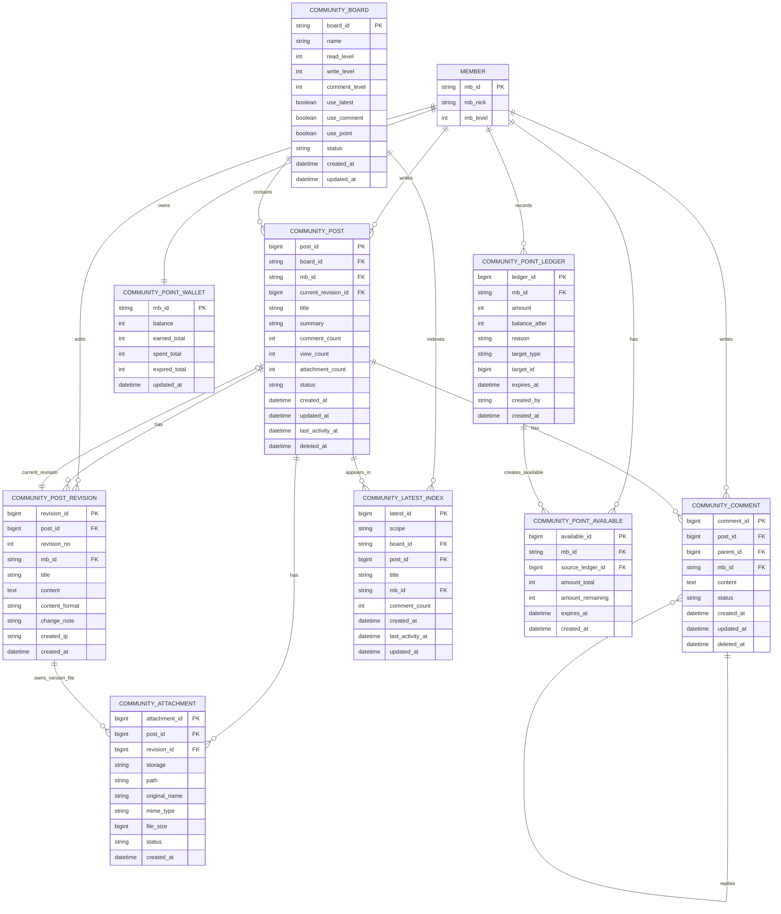

# 커뮤니티 기능 복구 상세 계획

## 1. 목적

현재 저장소는 회원, 인증, 관리자 기능 중심으로 재구성된 G5 런타임이다. 커뮤니티 기능은 기존 그누보드5 게시판을 그대로 되살리는 방식이 아니라, 기존 코드를 참조하되 현재 프로젝트의 도메인 구조와 운영 요구에 맞춰 새로 복구한다.

복구 대상의 핵심은 다음 세 가지다.

- 버전 이력 관리가 가능한 게시판
- 여러 화면에서 재사용 가능한 최신글 기능
- 회원 포인트와 분리된 커뮤니티 전용 포인트

고부하 운영 경험에서 확인된 병목을 설계 단계부터 피한다. 특히 게시판별 동적 테이블, 최신글 UNION, 목록 N+1 쿼리, 포인트 합산 계산, 테이블 단위 락, DB 기반 방문자/현재접속자 기록은 기본 구조로 채택하지 않는다.

## 2. 설계 원칙

### 2.1 기존 그누보드5는 참조만 한다

기존 그누보드5의 UI 흐름, 권한 개념, 게시판 설정 항목, 관리자 운영 방식은 참고한다. 그러나 다음 구조는 그대로 복구하지 않는다.

- `g5_write_{bo_table}` 방식의 게시판별 동적 테이블
- 여러 게시판 최신글을 UNION으로 조회하는 구조
- 게시글과 댓글을 한 테이블에 섞는 구조
- 포인트 잔액을 매번 전체 합산으로 계산하는 구조
- `get_unique()`처럼 테이블 단위 락을 잡는 키 생성 방식

### 2.2 현재 프로젝트의 도메인 경계를 따른다

새 커뮤니티 코드는 회원/관리자 도메인과 같은 스타일로 배치한다.

```text
community/
lib/domain/community/
community/views/basic/
adm/
```

컨트롤러 파일은 요청 흐름만 담당하고, 요청 정규화, 검증, 저장, 화면 데이터 구성은 `lib/domain/community/` 아래 함수로 분리한다.

### 2.3 읽기 부하를 쓰기 시점에 흡수한다

최신글, 댓글 수, 마지막 활동일, 포인트 잔액처럼 자주 읽히는 값은 읽을 때 매번 계산하지 않는다. 쓰기 트랜잭션 안에서 집계 컬럼이나 인덱스 테이블을 갱신한다.

### 2.4 모든 저장 작업은 트랜잭션 기준으로 설계한다

게시글 작성, 수정, 삭제, 댓글 작성, 포인트 지급은 모두 트랜잭션 단위로 처리한다. 포인트처럼 데드락 가능성이 높은 작업은 테이블 접근 순서를 고정한다.

권장 순서:

1. 대상 게시글 또는 댓글 row 잠금
2. 포인트 wallet row 잠금 또는 생성
3. 포인트 ledger 기록
4. 포인트 available 기록 또는 갱신
5. wallet 잔액 갱신
6. 게시글 집계 및 최신글 인덱스 갱신

### 2.5 목록 화면의 N+1 쿼리를 금지한다

게시글 목록에서 작성자, 댓글 수, 첨부 여부, 최신 revision 정보를 글마다 개별 조회하지 않는다. 목록 조회는 JOIN 또는 bulk fetch를 사용한다.

## 3. 디렉터리 계획

### 3.1 사용자 커뮤니티

```text
community/
  _common.php
  index.php
  board.php
  view.php
  write.php
  write_update.php
  delete.php
  comment_update.php
  revision.php
  latest.php
  views/
    basic/
      board.list.php
      board.view.php
      board.form.php
      comment.list.php
      revision.list.php
      latest.list.php
```

### 3.2 도메인 라이브러리

```text
lib/domain/community/
  community.lib.php
  runtime.lib.php
  request.lib.php
  validation.lib.php
  board-request.lib.php
  board-validation.lib.php
  board-persist.lib.php
  board-render.lib.php
  comment-request.lib.php
  comment-validation.lib.php
  comment-persist.lib.php
  latest.lib.php
  point.lib.php
  search.lib.php
  cache.lib.php
  admin-request.lib.php
  admin-validation.lib.php
  admin-persist.lib.php
  admin-render.lib.php
```

`community.lib.php`는 aggregate loader 역할만 맡는다. 세부 기능은 파일별로 나눈다.

### 3.3 관리자

```text
adm/
  admin.menu300.php
  community_board_list.php
  community_board_form.php
  community_board_form_update.php
  community_post_list.php
  community_revision_list.php
  community_point_list.php
  community_point_adjust.php
```

메뉴 코드는 `300000`대를 사용한다.

## 4. 상수 및 런타임 연결

`config.php`에 커뮤니티 경로 상수를 추가한다.

```php
define('G5_COMMUNITY_DIR', 'community');
define('G5_COMMUNITY_URL', G5_URL . '/' . G5_COMMUNITY_DIR);
define('G5_COMMUNITY_PATH', G5_PATH . '/' . G5_COMMUNITY_DIR);
define('G5_COMMUNITY_VIEW_PATH', G5_COMMUNITY_PATH . '/views');
```

테이블명은 `g5` 런타임 배열에 등록한다. 기존 `G5_TABLE_PREFIX`를 따른다.

```php
$g5['community_board_table'] = G5_TABLE_PREFIX . 'community_board';
$g5['community_post_table'] = G5_TABLE_PREFIX . 'community_post';
$g5['community_post_revision_table'] = G5_TABLE_PREFIX . 'community_post_revision';
$g5['community_comment_table'] = G5_TABLE_PREFIX . 'community_comment';
$g5['community_latest_table'] = G5_TABLE_PREFIX . 'community_latest_index';
$g5['community_point_ledger_table'] = G5_TABLE_PREFIX . 'community_point_ledger';
$g5['community_point_available_table'] = G5_TABLE_PREFIX . 'community_point_available';
$g5['community_point_wallet_table'] = G5_TABLE_PREFIX . 'community_point_wallet';
$g5['community_attachment_table'] = G5_TABLE_PREFIX . 'community_attachment';
```

등록 위치는 기존 테이블 배열이 초기화되는 파일을 확인한 뒤, 같은 레이어에 추가한다. 직접 전역을 흩뿌리지 않는다.

## 5. DB 스키마 계획

### 5.1 ERD



관계 해석 기준:

- `MEMBER`는 기존 회원 테이블을 의미하며, 새 커뮤니티 포인트는 기존 `mb_point`와 분리한다.
- `COMMUNITY_POST.current_revision_id`는 현재 노출할 revision을 가리킨다.
- `COMMUNITY_POST.updated_at`은 제목/본문 수정 시점이고, `last_activity_at`은 댓글 등 커뮤니티 활동 시점이다.
- `COMMUNITY_LATEST_INDEX`는 최신글 조회용 인덱스 테이블이며, 원본 게시글 데이터는 `COMMUNITY_POST`와 `COMMUNITY_POST_REVISION`에 둔다.
- `COMMUNITY_POINT_LEDGER`는 모든 포인트 변동 원장이고, `COMMUNITY_POINT_WALLET`은 잔액 캐시, `COMMUNITY_POINT_AVAILABLE`은 만료/차감 가능한 포인트 단위다.

### 5.2 게시판 설정

`community_board`

| 컬럼 | 설명 |
| --- | --- |
| `board_id` | 게시판 ID, 영문/숫자/underscore |
| `name` | 게시판 이름 |
| `description` | 관리자 설명 |
| `read_level` | 읽기 권한 레벨 |
| `write_level` | 쓰기 권한 레벨 |
| `comment_level` | 댓글 권한 레벨 |
| `list_order` | 관리자 정렬 |
| `use_latest` | 최신글 노출 여부 |
| `use_comment` | 댓글 사용 여부 |
| `use_point` | 커뮤니티 포인트 사용 여부 |
| `point_write` | 글 작성 지급 포인트 |
| `point_comment` | 댓글 작성 지급 포인트 |
| `point_read` | 열람 차감 또는 지급 포인트 |
| `status` | active, hidden, archived |
| `created_at` | 생성일 |
| `updated_at` | 수정일 |

주요 인덱스:

- `PRIMARY KEY (board_id)`
- `KEY idx_status_order (status, list_order)`
- `KEY idx_latest (use_latest, status)`

### 5.3 게시글 현재 상태

`community_post`

| 컬럼 | 설명 |
| --- | --- |
| `post_id` | 게시글 PK |
| `board_id` | 게시판 ID |
| `mb_id` | 작성자 |
| `current_revision_id` | 현재 revision |
| `title` | 목록용 현재 제목 |
| `summary` | 최신글/목록용 요약 |
| `comment_count` | 댓글 수 캐시 |
| `view_count` | 조회 수 |
| `attachment_count` | 첨부 수 |
| `status` | published, hidden, deleted |
| `created_at` | 최초 작성일 |
| `updated_at` | 제목/본문 수정일 |
| `last_activity_at` | 댓글 등 활동 갱신일 |
| `deleted_at` | 삭제일 |

주요 인덱스:

- `PRIMARY KEY (post_id)`
- `KEY idx_board_list (board_id, status, last_activity_at, post_id)`
- `KEY idx_board_created (board_id, status, created_at, post_id)`
- `KEY idx_author (mb_id, created_at)`
- `KEY idx_updated (updated_at, post_id)`

`updated_at`은 게시글 자체 수정에만 사용한다. 댓글 작성으로 바꾸지 않는다. 검색 델타 인덱싱은 `updated_at` 또는 revision ID를 기준으로 한다.

### 5.4 게시글 버전 이력

`community_post_revision`

| 컬럼 | 설명 |
| --- | --- |
| `revision_id` | revision PK |
| `post_id` | 게시글 ID |
| `revision_no` | 게시글별 버전 번호 |
| `mb_id` | 수정자 |
| `title` | 해당 버전 제목 |
| `content` | 해당 버전 본문 |
| `content_format` | html, markdown, plain |
| `change_note` | 수정 사유 |
| `created_ip` | 작성 IP |
| `created_at` | 버전 생성일 |

주요 인덱스:

- `PRIMARY KEY (revision_id)`
- `UNIQUE KEY uq_post_revision_no (post_id, revision_no)`
- `KEY idx_post_created (post_id, created_at)`

수정은 기존 row update가 아니라 revision insert로 기록한다. `community_post.current_revision_id`만 새 revision을 가리키게 갱신한다.

### 5.5 댓글

`community_comment`

| 컬럼 | 설명 |
| --- | --- |
| `comment_id` | 댓글 PK |
| `post_id` | 게시글 ID |
| `parent_id` | 대댓글 부모 |
| `mb_id` | 작성자 |
| `content` | 댓글 내용 |
| `status` | published, hidden, deleted |
| `created_at` | 작성일 |
| `updated_at` | 수정일 |
| `deleted_at` | 삭제일 |

주요 인덱스:

- `PRIMARY KEY (comment_id)`
- `KEY idx_post_list (post_id, status, comment_id)`
- `KEY idx_author (mb_id, created_at)`

댓글은 게시글 테이블과 분리한다. 댓글 작성 시 `community_post.comment_count`, `last_activity_at`만 갱신한다.

### 5.6 최신글 인덱스

`community_latest_index`

| 컬럼 | 설명 |
| --- | --- |
| `latest_id` | PK |
| `scope` | all 또는 board |
| `board_id` | 게시판 ID, 전체 최신글이면 빈 값 |
| `post_id` | 게시글 ID |
| `title` | 최신글 표시 제목 |
| `mb_id` | 작성자 |
| `comment_count` | 댓글 수 |
| `created_at` | 게시글 작성일 |
| `last_activity_at` | 정렬 기준 |
| `updated_at` | 인덱스 갱신일 |

주요 인덱스:

- `UNIQUE KEY uq_scope_post (scope, board_id, post_id)`
- `KEY idx_scope_latest (scope, board_id, last_activity_at, post_id)`

최신글은 조회 시 UNION하지 않는다. 게시글 생성, 수정, 삭제, 댓글 작성, 댓글 삭제 이벤트에서 인덱스를 갱신한다.

### 5.7 커뮤니티 포인트 원장

`community_point_ledger`

| 컬럼 | 설명 |
| --- | --- |
| `ledger_id` | 원장 PK |
| `mb_id` | 회원 ID |
| `amount` | 증감 포인트 |
| `balance_after` | 처리 후 잔액 |
| `reason` | write, comment, read, admin_adjust 등 |
| `target_type` | post, comment, admin 등 |
| `target_id` | 대상 ID |
| `expires_at` | 만료일, 없으면 NULL |
| `created_by` | 관리자 또는 시스템 |
| `created_at` | 생성일 |

주요 인덱스:

- `PRIMARY KEY (ledger_id)`
- `KEY idx_member_ledger (mb_id, ledger_id)`
- `KEY idx_target (target_type, target_id)`
- `KEY idx_expires (expires_at)`

중복 지급 방지가 필요한 사유는 별도 유니크 키를 검토한다.

예:

```text
UNIQUE KEY uq_once_reward (mb_id, reason, target_type, target_id)
```

단, 관리자 수동 조정처럼 반복 가능한 사유에는 적용하지 않는다.

### 5.8 사용 가능 포인트

`community_point_available`

| 컬럼 | 설명 |
| --- | --- |
| `available_id` | PK |
| `mb_id` | 회원 ID |
| `source_ledger_id` | 지급 원장 ID |
| `amount_total` | 최초 지급량 |
| `amount_remaining` | 남은 포인트 |
| `expires_at` | 만료일 |
| `created_at` | 생성일 |

주요 인덱스:

- `KEY idx_member_available (mb_id, expires_at, available_id)`
- `KEY idx_source_ledger (source_ledger_id)`

포인트 차감 시 만료가 빠른 단위부터 차감한다.

### 5.9 포인트 잔액

`community_point_wallet`

| 컬럼 | 설명 |
| --- | --- |
| `mb_id` | 회원 ID |
| `balance` | 현재 잔액 |
| `earned_total` | 누적 지급 |
| `spent_total` | 누적 사용/차감 |
| `expired_total` | 누적 만료 |
| `updated_at` | 갱신일 |

주요 인덱스:

- `PRIMARY KEY (mb_id)`

회원 테이블의 `mb_point`와 분리한다.

### 5.10 첨부파일

`community_attachment`

| 컬럼 | 설명 |
| --- | --- |
| `attachment_id` | PK |
| `post_id` | 게시글 ID |
| `revision_id` | 연결 revision |
| `storage` | local, s3 등 |
| `path` | 로컬 경로 또는 object key |
| `original_name` | 원본 파일명 |
| `mime_type` | MIME |
| `file_size` | 크기 |
| `status` | active, deleted |
| `created_at` | 생성일 |

목록에서 파일 존재 여부를 확인하기 위해 파일 시스템 I/O를 반복하지 않는다. 첨부 수와 대표 첨부 정보는 DB에서 판단한다.

## 6. 기능별 상세 계획

### 6.1 게시판 목록

목표:

- 게시글 목록을 한 번의 주 쿼리로 가져온다.
- 작성자 닉네임, 댓글 수, 첨부 수를 글마다 개별 조회하지 않는다.

조회 방식:

1. `community_post`에서 board/status/page 기준으로 목록 조회
2. 필요한 작성자 ID 목록을 수집
3. 회원 정보를 bulk fetch하거나 JOIN
4. 화면 view model 생성

금지 패턴:

```php
foreach ($posts as $post) {
    $writer = get_member($post['mb_id']);
}
```

허용 패턴:

```php
$posts = community_fetch_post_list($board_id, $request);
$members = community_fetch_member_map(array_column($posts, 'mb_id'));
```

### 6.2 게시글 작성

처리 순서:

1. 요청 정규화
2. 게시판 존재 및 쓰기 권한 확인
3. CSRF 토큰 확인
4. 제목/본문 검증
5. 본문 정화
6. 트랜잭션 시작
7. `community_post` insert
8. `community_post_revision` revision 1 insert
9. `community_post.current_revision_id` update
10. 첨부파일 기록
11. 최신글 인덱스 갱신
12. 커뮤니티 포인트 지급
13. 트랜잭션 commit

본문 정화는 HTMLPurifier 객체를 매번 새로 만들지 않고 재사용한다.

### 6.3 게시글 수정

처리 순서:

1. 게시글 row 조회 및 권한 확인
2. CSRF 토큰 확인
3. 제목/본문 검증
4. 트랜잭션 시작
5. 게시글 row 잠금
6. 마지막 `revision_no` 조회
7. 새 revision insert
8. `community_post`의 제목, summary, current_revision_id, updated_at 갱신
9. 최신글 인덱스 갱신
10. 트랜잭션 commit

수정 사유 `change_note`는 선택값으로 받되 관리자 화면에서는 노출한다.

### 6.4 게시글 삭제

물리 삭제를 기본으로 하지 않는다.

처리 순서:

1. 권한 확인
2. CSRF 토큰 확인
3. 트랜잭션 시작
4. `community_post.status = deleted`, `deleted_at` 갱신
5. 댓글 status 일괄 갱신 또는 게시글 단위 숨김 처리
6. 최신글 인덱스 제거
7. 작성 보상 포인트 회수 정책 적용
8. 트랜잭션 commit

포인트 회수 정책은 게시판 설정으로 분리한다.

정책 후보:

- 삭제해도 기존 지급 포인트 유지
- 작성자 삭제 시 회수
- 관리자 삭제 시 회수하지 않음
- 일정 기간 안의 삭제만 회수

### 6.5 버전 이력 조회

사용자 화면:

- 작성자와 관리자에게 이전 revision 목록 제공
- 일반 사용자는 현재 revision만 조회

관리자 화면:

- 게시글별 revision 비교
- 수정자, 수정일, 수정 IP, 수정 사유 확인

추후 확장:

- 두 revision 간 diff 표시
- 특정 revision 복원

복원은 새 revision을 추가하는 방식으로 처리한다. 과거 revision을 직접 현재값으로 덮어쓰지 않는다.

### 6.6 댓글

댓글은 MVP에서 1단계 댓글만 먼저 지원한다. 대댓글은 `parent_id`를 열어두되 UI는 후속 단계에서 확장한다.

댓글 작성 시:

1. 게시글 row 잠금
2. 댓글 insert
3. 게시글 `comment_count`, `last_activity_at` 갱신
4. 최신글 인덱스 갱신
5. 댓글 작성 포인트 지급

댓글 삭제 시:

1. 댓글 status 변경
2. 게시글 `comment_count` 차감
3. 필요 시 `last_activity_at` 재계산
4. 최신글 인덱스 갱신
5. 댓글 작성 포인트 회수 정책 적용

`last_activity_at` 재계산은 비싼 작업이 될 수 있으므로, 삭제 빈도와 정책을 보고 비동기 또는 제한 조회로 처리한다.

### 6.7 최신글

최신글 함수는 다음 형태를 목표로 한다.

```php
community_latest(array(
    'board_id' => 'notice',
    'limit' => 5,
    'include_comments' => true,
));
```

전체 최신글:

```php
community_latest(array(
    'scope' => 'all',
    'limit' => 10,
));
```

처리 방식:

1. `community_latest_index`에서 조회
2. cache adapter가 있으면 캐시 우선 사용
3. 캐시 미스 시 인덱스 조회 후 캐시 저장

무효화 시점:

- 글 작성
- 글 수정
- 글 삭제
- 댓글 작성
- 댓글 삭제
- 게시판 최신글 사용 여부 변경

### 6.8 커뮤니티 포인트

회원 포인트와 완전히 분리한다.

포인트 지급 함수:

```php
community_point_grant($mb_id, $amount, array(
    'reason' => 'write',
    'target_type' => 'post',
    'target_id' => $post_id,
    'expires_at' => null,
));
```

포인트 차감 함수:

```php
community_point_spend($mb_id, $amount, array(
    'reason' => 'read',
    'target_type' => 'post',
    'target_id' => $post_id,
));
```

트랜잭션 규칙:

- 동일 회원의 wallet row를 먼저 잠근다.
- 지급은 ledger insert 후 available insert, wallet update 순서로 처리한다.
- 차감은 wallet row 잠금 후 available 차감, ledger insert, wallet update 순서로 처리한다.
- 모든 포인트 변경은 ledger에 기록한다.

데드락 완화:

- 여러 회원을 동시에 처리해야 할 경우 `mb_id` 정렬 순서로 잠근다.
- 게시글/댓글/포인트를 함께 처리하는 경우 접근 순서를 고정한다.
- 실패 시 제한된 횟수만 재시도할 수 있게 한다.

### 6.9 검색

MVP:

- 게시판 단위 제목/작성자 검색
- 본문 LIKE 검색은 관리자 설정으로 제한
- 통합검색은 기본 제공하지 않음

확장:

- 검색 인덱스 adapter 추가
- 델타 인덱싱 기준은 `community_post.updated_at` 또는 `community_post_revision.revision_id`
- 댓글 활동으로 게시글 `updated_at`을 변경하지 않음

### 6.10 방문자/현재접속자

MVP 범위에서 제외한다.

운영 통계는 다음 중 하나를 사용한다.

- 외부 분석 도구
- 웹서버 로그 기반 집계
- 비동기 이벤트 수집

요청마다 DB에 방문자 또는 현재접속자 row를 쓰는 구조는 도입하지 않는다.

## 7. 캐시 계획

### 7.1 cache adapter

커뮤니티 전용 cache wrapper를 둔다.

```php
community_cache_get($key);
community_cache_set($key, $value, $ttl = 60);
community_cache_delete($key);
community_cache_delete_group($group);
```

초기 구현:

- 파일 캐시 또는 기존 `cache.lib.php` wrapper

운영 확장:

- Redis adapter

캐시 키 예:

```text
community:latest:all:10
community:latest:board:notice:5
community:board:notice
community:post:view:123
```

### 7.2 캐시 사용 기준

캐시는 DB 정합성을 대체하지 않는다.

- 게시글 본문 저장 원본은 DB
- 최신글 정렬 원본은 `community_latest_index`
- 캐시는 조회 최적화 레이어

캐시가 비어도 기능이 정상 동작해야 한다.

## 8. 성능 점검 계획

### 8.1 중복 쿼리 감지

현재 SQL 레이어는 `G5_COLLECT_QUERY`와 debug 정보를 수집할 수 있다. 커뮤니티 개발 단계에서 다음 정보를 확인한다.

- 동일 SQL 반복 횟수
- 동일 호출 위치 반복 횟수
- request당 총 query 수
- request당 총 SQL 시간

관리자 전용 debug 화면 또는 로그 요약으로 먼저 구현하고, UI는 후속 단계로 미룬다.

### 8.2 목록 성능 기준

게시글 목록 1페이지 기준 목표:

- 게시글 목록 조회 1회
- 회원 정보 조회 1회 또는 JOIN 1회
- 게시판 설정 조회 캐시
- 최신글 sidebar가 있으면 최신글 조회 1회

게시글 수에 비례해 쿼리 수가 증가하면 실패로 본다.

### 8.3 인덱스 검토 기준

다음 쿼리는 `EXPLAIN`으로 인덱스 사용을 확인한다.

- 게시판 목록
- 전체 최신글
- 게시판 최신글
- 작성자 글 목록
- revision 목록
- 포인트 원장 목록
- 사용 가능 포인트 차감 대상 조회

## 9. 보안 계획

### 9.1 SQL

- 모든 신규 SQL은 `sql_query_prepared`, `sql_fetch_prepared`, `sql_fetch_all_prepared`를 사용한다.
- 동적 identifier가 필요한 경우 `sql_quote_identifier()`를 사용한다.
- 사용자 입력으로 테이블명 또는 컬럼명을 직접 조립하지 않는다.

### 9.2 CSRF

- 사용자 저장 action은 `check_token()`을 사용한다.
- 관리자 저장 action은 `check_admin_token()`을 사용한다.
- AJAX 저장 action도 동일한 token 흐름을 따른다.

### 9.3 XSS

- 제목은 태그 제거 후 escape 출력한다.
- 본문은 저장 전 HTMLPurifier 정책을 통과시킨다.
- 출력 시에도 context에 맞게 escape한다.

### 9.4 권한

권한 검사는 다음 순서로 한다.

1. 게시판 존재 확인
2. 게시판 상태 확인
3. 회원 로그인 여부 확인
4. 회원 레벨 확인
5. 작성자 또는 관리자 여부 확인

관리자 권한은 기존 `auth_check_menu()` 체계를 따른다.

### 9.5 토큰과 비밀값

새로운 nonce, 링크 키, 검증 키가 필요한 경우 다음 규칙을 따른다.

- 난수는 `random_bytes()` 또는 프로젝트 helper 사용
- 비교는 `hash_equals()` 또는 `g5_hash_equals()` 사용
- 비밀값 기반 검증은 HMAC helper 사용
- `rand()`, `mt_rand()`, `uniqid()`, 단순 `md5()` 금지

## 10. 관리자 기능 계획

### 10.1 커뮤니티 게시판 관리

기능:

- 게시판 생성/수정
- 사용 여부 변경
- 읽기/쓰기/댓글 권한 설정
- 최신글 노출 여부 설정
- 포인트 지급 정책 설정

### 10.2 게시글 관리

기능:

- 게시판별 게시글 검색
- 숨김/삭제 처리
- 작성자 기준 검색
- 기간 검색
- revision 이력 진입

### 10.3 버전 이력 관리

기능:

- 게시글별 revision 목록
- revision 상세 보기
- 수정자/수정 IP/수정 사유 확인
- 특정 revision 복원

복원은 새 revision 생성으로 처리한다.

### 10.4 커뮤니티 포인트 관리

기능:

- 회원별 wallet 조회
- ledger 조회
- 관리자 지급/차감
- 만료 예정 포인트 조회
- ledger와 wallet 대조 점검

관리자 수동 조정도 ledger에 기록한다.

## 11. 마이그레이션 및 설치 계획

현재 저장소에는 명확한 DB migration 체계가 없다. 초기에는 다음 중 하나로 시작한다.

1. `sql/community_schema.sql` 추가
2. 관리자 점검 화면에서 누락 테이블 생성
3. 별도 CLI 설치 스크립트 추가

권장 시작안은 SQL 파일이다. 자동 생성 루틴은 운영 실수 가능성이 있으므로 관리자 확인 후 실행하는 방식으로 둔다.

마이그레이션 원칙:

- `CREATE TABLE IF NOT EXISTS` 사용
- `ALTER TABLE`은 단계별로 분리
- 운영 데이터 변경 전 백업 전제
- 기존 그누보드 게시판 import는 별도 스크립트로 분리

## 12. 기존 데이터 import 계획

기존 그누보드5 데이터를 가져와야 할 경우 다음 순서로 진행한다.

1. 기존 게시판 목록을 `community_board`로 매핑
2. `g5_write_{bo_table}` 글 row를 `community_post`로 변환
3. 각 글의 현재 내용을 `community_post_revision` revision 1로 생성
4. 댓글 row를 `community_comment`로 분리
5. 첨부파일을 `community_attachment`로 변환
6. 최신글 인덱스 재생성
7. 커뮤니티 포인트는 기존 회원 포인트와 섞지 않고, 필요한 경우 별도 import ledger로 기록

import는 반복 실행 가능하게 설계한다.

## 13. 단계별 구현 일정

### 13.1 1단계: 기반 스키마와 런타임

산출물:

- 커뮤니티 상수 추가
- 커뮤니티 테이블명 등록
- `lib/domain/community/` loader 추가
- `community/_common.php` 추가
- DB 스키마 SQL 추가

완료 기준:

- 커뮤니티 공통 진입 파일에서 기존 회원/관리자 런타임을 정상 사용할 수 있다.
- 테이블 생성 SQL이 로컬 DB에 적용 가능하다.

### 13.2 2단계: 게시판 MVP

산출물:

- 게시판 목록
- 게시글 보기
- 게시글 작성
- 게시글 수정
- 게시글 soft delete
- revision 생성

완료 기준:

- 글 작성 시 post와 revision이 함께 생성된다.
- 글 수정 시 기존 revision이 보존되고 새 revision이 생성된다.
- 게시글 보기에서 현재 revision을 표시한다.

### 13.3 3단계: 최신글

산출물:

- `community_latest_index`
- 최신글 갱신 함수
- 최신글 조회 함수
- 메인 또는 커뮤니티 홈 최신글 partial

완료 기준:

- 글 작성/수정/삭제 후 최신글 결과가 맞다.
- 여러 게시판 최신글 조회에 UNION이 없다.

### 13.4 4단계: 댓글

산출물:

- 댓글 작성/삭제
- 댓글 목록
- 게시글 comment_count 갱신
- last_activity_at 갱신

완료 기준:

- 댓글 작성 후 게시글 목록의 댓글 수와 최신 활동일이 맞다.
- 댓글 쿼리 수가 댓글 수에 비례해 증가하지 않는다.

### 13.5 5단계: 커뮤니티 포인트

산출물:

- 포인트 wallet/ledger/available 처리
- 글 작성 지급
- 댓글 작성 지급
- 관리자 수동 조정

완료 기준:

- 포인트 변경이 ledger에 모두 기록된다.
- wallet 잔액이 ledger와 대조 가능하다.
- 중복 지급 방지 정책이 동작한다.

### 13.6 6단계: 관리자

산출물:

- 게시판 관리
- 게시글 관리
- revision 조회
- 포인트 원장 조회

완료 기준:

- 관리자 메뉴에서 커뮤니티 운영 작업을 수행할 수 있다.
- 모든 저장 action에 관리자 토큰 검증이 적용된다.

### 13.7 7단계: 성능/운영 보강

산출물:

- 중복 쿼리 감지 요약
- 캐시 adapter
- 주요 쿼리 EXPLAIN 점검
- 검색 확장 지점

완료 기준:

- 게시글 목록/최신글/포인트 주요 흐름의 쿼리 수와 인덱스를 확인했다.
- Redis 도입 없이도 기능이 동작하고, Redis adapter로 확장 가능하다.

## 14. 테스트 계획

### 14.1 단위 수준

- request 정규화
- 권한 검증
- 게시글 저장
- revision 번호 증가
- 최신글 인덱스 갱신
- 포인트 지급/차감
- 포인트 중복 지급 방지

### 14.2 통합 수준

- 회원 글 작성
- 회원 글 수정
- 작성자 삭제
- 관리자 삭제
- 댓글 작성/삭제
- 최신글 표시
- 포인트 원장 확인

### 14.3 회귀 기준

- 회원가입, 로그인, 로그아웃이 깨지지 않아야 한다.
- 관리자 회원 목록과 환경설정이 깨지지 않아야 한다.
- 기존 회원 포인트 또는 회원 테이블 의미가 바뀌지 않아야 한다.

## 15. 주요 리스크와 대응

| 리스크 | 대응 |
| --- | --- |
| 기존 그누보드 import 요구가 커짐 | import 스크립트를 본 기능과 분리 |
| 최신글 캐시 정합성 오류 | DB 인덱스 테이블을 원본으로 두고 캐시는 보조로 사용 |
| 포인트 데드락 | 트랜잭션 접근 순서 고정, wallet row 기준 잠금 |
| 목록 N+1 재발 | bulk fetch 패턴과 중복 쿼리 감지 도입 |
| 검색 부하 | MVP 통합검색 제외, 검색 인덱스 adapter 설계 |
| 첨부/프로필 I/O 증가 | 존재 여부와 storage metadata를 DB에 저장 |
| HTMLPurifier 메모리 증가 | purifier factory에서 객체 재사용 |

## 16. 첫 개발 단위

가장 먼저 구현할 단위는 다음으로 제한한다.

1. 커뮤니티 스키마 SQL
2. `community_board`, `community_post`, `community_post_revision`
3. 게시글 목록/보기/작성/수정
4. 수정 시 revision 이력 생성
5. 최신글 인덱스 갱신의 최소 구현

이 단위가 완료되면 댓글과 포인트를 붙인다. 포인트는 구조 영향이 크므로 기존 회원 포인트와 절대 섞지 않고 별도 기능으로 검증한다.
